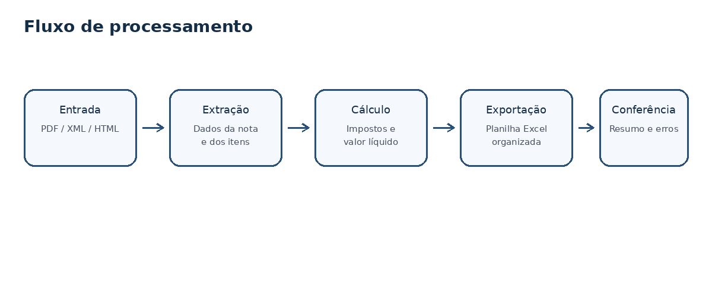
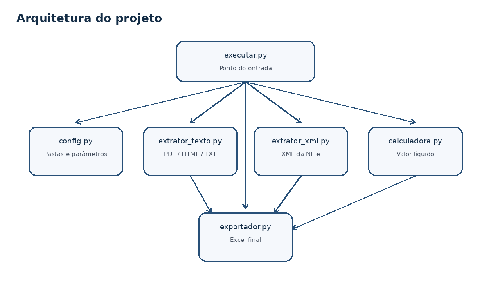

# Robô de Valor Líquido para DANFE

Automação em Python para leitura de documentos fiscais, extração de dados dos itens e geração de uma planilha Excel com cálculo de valor líquido.

## Visão geral

O projeto foi criado para reduzir atividades manuais em rotinas que envolvem conferência de DANFEs, leitura de itens e cálculo de valores líquidos. A solução processa documentos em lote, organiza os dados por nota fiscal e exporta um arquivo final em Excel para conferência.



## Funcionalidades

- Leitura de múltiplos documentos em uma pasta de entrada.
- Extração de dados de DANFE em PDF, HTML, TXT e XML.
- Identificação de chave de acesso, número da NF, emitente, destinatário e itens.
- Cálculo de ICMS, PIS, COFINS, IPI, valor líquido total e valor líquido unitário.
- Geração de planilha Excel com abas de resultado, documentos, resumo e erros.
- Registro de logs e tratamento de falhas sem interromper todos os documentos.

## Tecnologias

- Python
- Pandas
- OpenPyXL
- PDFPlumber
- BeautifulSoup

## Estrutura

```text
robo-valor-liquido-danfe/
├── 01_documentos_para_analisar/
├── 02_resultados/
├── 03_logs/
├── 04_documentos_processados/
├── docs/
├── examples/
├── src/
├── tests/
├── executar.py
├── requirements.txt
├── README.md
└── .gitignore
```

## Como executar

Instale as dependências:

```bash
pip install -r requirements.txt
```

Coloque os documentos na pasta:

```text
01_documentos_para_analisar
```

Execute:

```bash
python executar.py
```

O Excel final será gerado em:

```text
02_resultados/resultado_valor_liquido.xlsx
```

## Saída gerada

A planilha final possui abas para facilitar a conferência:

- **Resultado Final**: itens extraídos e cálculos linha por linha.
- **Documentos**: resumo por arquivo analisado.
- **Resumo**: indicadores gerais do processamento.
- **Erros**: documentos que exigem revisão manual.

## Fórmula aplicada

O cálculo principal considera os percentuais definidos no arquivo de configuração:

```text
Valor ICMS = (Valor Total + IPI calculado) × Alíquota ICMS
Base PIS/COFINS = Valor Total - Valor ICMS
Valor PIS = Base PIS/COFINS × PIS
Valor COFINS = Base PIS/COFINS × COFINS
Valor Líquido Total = Valor Total - ICMS - PIS - COFINS
Valor Líquido Unitário = Valor Líquido Total / Quantidade
```

## Segurança dos dados

Este repositório não contém DANFEs reais, XMLs reais, chaves de acesso, planilhas internas ou informações de empresas. As pastas de entrada, saída, logs e processados são ignoradas pelo Git para evitar o envio acidental de arquivos sensíveis.

## Arquitetura



## Status

Projeto funcional para fins de automação, estudo e portfólio. Pode ser adaptado para diferentes layouts de documentos fiscais e rotinas de conferência.
